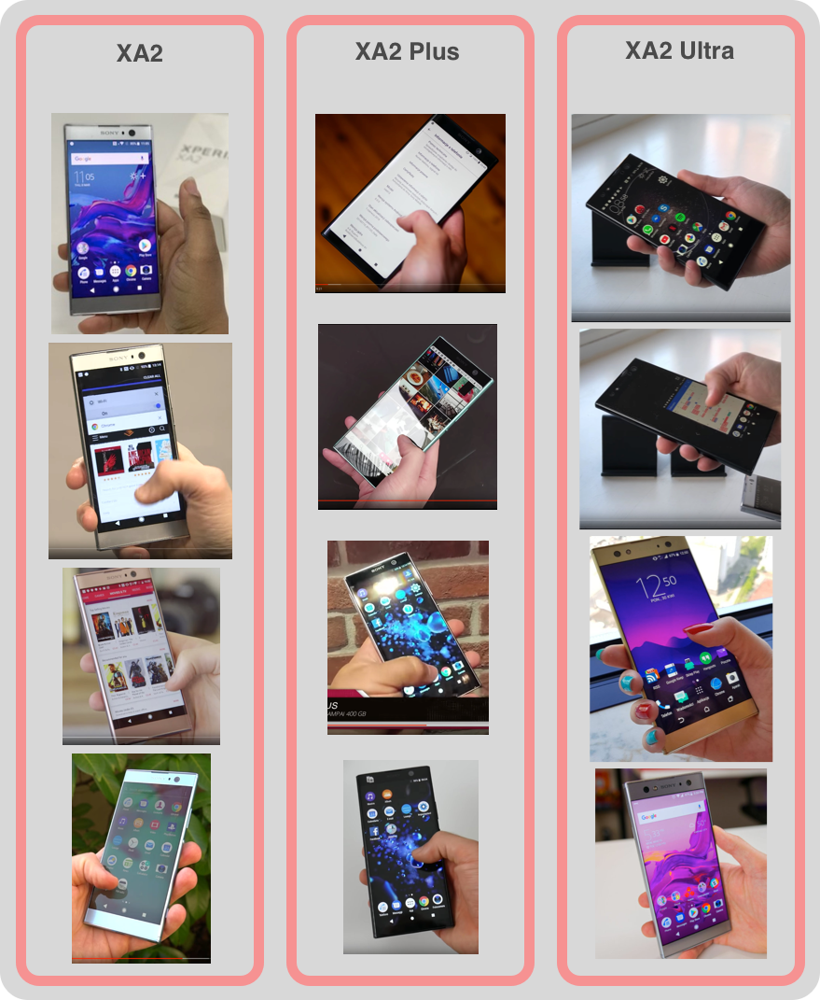
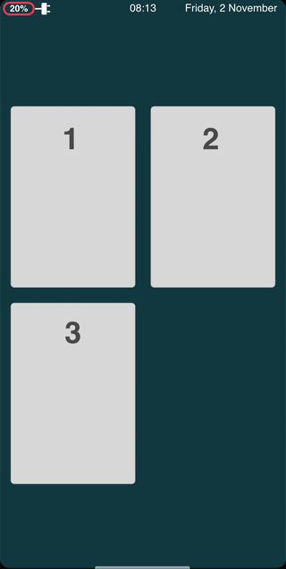

<link href="style.css" rel="stylesheet">

<span style="font-family: Fira Code">

# UX Case Study: Sailfish OS

As with most case studies the idea is to explore the current state of a particular area and make some propositions about impoving it.

So without much babble let's get starting.

***

First, let's talk context. We have to deal with multiple contexts. So let's find the borders/limitations we have to work with.

#### 1. Hardware Limitations

Now let's start with what we know. **`Jolla`** are not making hardware anymore so they don't have much control here. Taking this is concideration and moving on with the currently supported devices.


<pre>
<strong>Mobile Phones</strong>: 
- Jolla (4.5 inch, 16:9 ratio)
- Jolla C (5.0 inch, 16:9 ratio)
- Sony Xperia X (5.0 inch, 16:9 ratio)
- Sony XA2 (5.2 inch, 16:9 ratio)
- Sony XA2 Ultra (6.0 inch, 16:9 ratio)
- Sony XA2 Plus (6.0 inch, 18:9 ratio)

<strong>Tablets</strong>: 
- Jolla Tablet (7.85inch, 4:3 ratio)
</pre>


Based on the screen sizes we can limit the scope a bit.
Phone makers are probably going to stay with the current trend of bigger screens for some time. (Possibly the upcomming folding phones will disrupt this trend).

In the context of hardware, the differences are mostly dimensional. Sadly, different and more inovative types of hardware for interacting with the devices are hard to find. So let’s focus just on the screen dimensions for now.

<br>

Let's take the current line of phones in the eco-system to find potential weak points.

<br>

##### Current device line
<p align="center">
    
</p>

<br>

Since not having a proper crowdsourcing I will be using screenshots (from review videos) of one-handed use of actual people holding the various version and not just posing for picture with the product. We can see the following:


> - <strong>XA2</strong>: Most people hold the phone with their pinky on the bottom lip.
> - <strong>XA2 Plus</strong>: Most people hold the phone more to the middle. Actually most people use the phone with two hands.
> - <strong>XA2 Ultra</strong>: The same as XA2 Plus.

With the **"one-handed"** information (which to be honest is not much, but still something) we can start analyzing:

> - <strong>XA2</strong>: Keeping your pinky on the bottom lip of the phone still gives enough grip and the phone can be used for somewhat normal operation. Top of the screen is unreachable. The opposite horizontal edge is unreachable.
> - <strong>XA2 Plus</strong>: Users hold the phone more to the middle. Most possible explanation is weight balance, otherwise there would not be enough grip. Bottom of the screen is harder to reach(more on that later). Top of the screen is unreachable. The opposite horizontal edge is unreachable.
> - <strong>XA2 Ultra</strong>: The same as XA2 Plus.

So we can see the most common weak point these days:

- **Reachability** - in all versions of the XA2

<br>

**Check the weak points against Sailfish OS 3:**


> <strong>1.</strong> One-handed navigation is even worse because unreachability 
> <strong>2.</strong> Quick closing an App on Sailfish 3 - with the top of the screen being unreachable this is a problem. Also this is only possible from the left or right portion of the top edge.


Other issues can mainly come from the size of the device and not the OS itself.
</pre>

***

Thinking about worst case scenario, I tried to make a heatmap of the reachability situation on the XA2 Plus.

Now I will excuse myself again. This was done within limited usage time. And without proper crowdsourcing this shouldn't be taken seriously. Based on my hand size(considering myself having normal hand size).

```
Green Area - the reachable part of the screen
Orange Area - the trickier to reach part of the screen
Red Area - unreachable
```

<br>

<p align="center">
    
</p>

***

#### 2. Software Limitations

Again, let's start with what we already have and then see if something can be proposed.

Sailfish is a gesture based navigation. And in it's current state it looks like this:

<p align="center">
    
</p>

And the **`Quick Close`** gesture is accessible only from the Top Left or the Top Right. And the Top of the screen is not easy to reach (especially on the XA2 Plus and Ultra). So here we can think about some improvement.

<p align="center">
    
</p>

<br>

Let's examine the navigation screens which may have reachability issues.


> <strong>1. Home:</strong>
> - With just 2 App Covers on a row there will be no problem.
> - But with 3 App Covers on a row it may get tricky to hit App Covers in the opposite edges on the Top of the screen.

> <strong>2. Events </strong>
> - Since the Top part is used as a Presentational component with no controls,there are no problems.

> <strong>3. Apps </strong>
> - App Icons on the Top may not be reachable.

> <strong>4. Top Menu </strong>
> - Some of the Quick Toggles on the Top may not be reachable.

<br>
<br>

***

#### Propositions

Some propositions will be given to improve the current Navigation.

Let's start with the `Quick Close`.


#### * Quick Close

Currently the `Quick Close` is triggered with a swipe down from the Left or the Right part of the Top edge. Since the Top edge of the screen is hardly reachable this can be improved. The problem is `where and how`.

**`Where`** - it needs to go lower. This leave us with the Left, Right, Bottom edge to initiate it. The side edges give us best reachability regardless of the way the phone is held. So lets try from the Left and Right edge.

**`How`**(it will be triggered?) - The `Left` and `Right` edges are used for Navigation between Home and Events. So we will need new gesture. Something without adding too much complexity and preventing accidental closing. So let's check the natural swipe direction and go from there. The natural direction of a swipe from the edge is sideways and going down. So if the opposite direction is used for `Quick Closing` an App, this will prevent from accidental closing. Let's check it.

<p align="center">
    
</p>

And there it is a with a hint at the top of the screen telling the user what is going to happen. 

<p align="center">
    
</p>

Now the `Top Edge` is decluttered.

Which lead us to the `Top Menu`. What can be done there? The `Top Menu` can be accessed from three places - from `Home, Events, In-App`. What if we want more "one-hand" friendly use. What if the swipe direction from `Home` to `Events` is recored and used for rearanging the `Top Menu` in a more compact form. Demonstration will clear out the idea.

| Left Swipe | From Home | Right Swipe |
| -------- | -------- | -------- |
|    |  |  |

This is not the about the UI (colors, icon shapes etc) but more about the UX so here is a little comparison of the old vs the proposed:

<p align="center">
    
</p>

<br>
<br>

 ***

And for 

#### * Quick Close


</span>